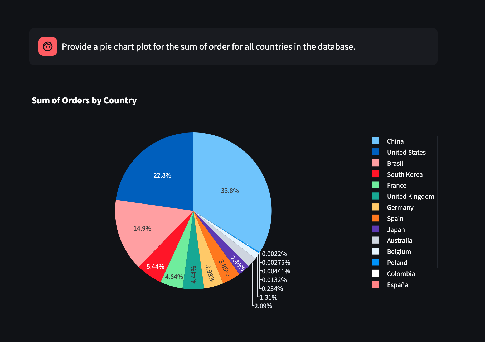

# Auto Insights

## Description
A quick POC which showcases the augmentation of llms using AI Agents. 
We use SQL Generator and retriver agent to convert text to sql and source the data use the SQL DAtabase Tool Kit.
The data generated by the sql generator agent can be used by the Python REPL toolkit to generate dynamic graphs and plots.

Here I have integrated langchains tools as agents to the OPEN AI LLM App.
The two agents being used are:
1. [SQLDatabase Toolkit](https://python.langchain.com/docs/integrations/tools/sql_database/)
2. [PythonREPLTool](https://python.langchain.com/api_reference/experimental/tools/langchain_experimental.tools.python.tool.PythonREPLTool.html)

Try it out on your own database or mock databases. You can use either download the app locally and use it on your own local datasets or you can use one of the cloud vendoers to host your own db.
Currently the app is wired to use MySQL Database only. It should be relatively easy to augment it to support other databases.

The app is hosted on streamlit with the url -> https://dbu-auto-insights.streamlit.app/

Below is an example of the usage on a publickly available ecommerce dataset.

